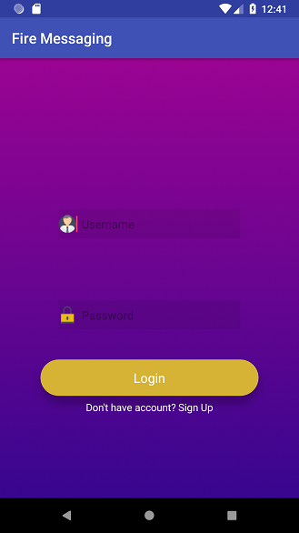
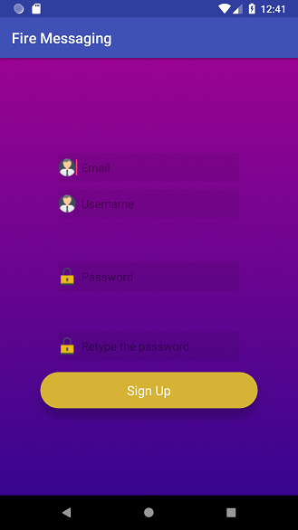
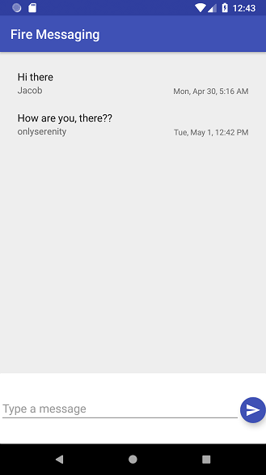

# FireMessaging
Android messaging app built using android studio and firebase database.
The user must sign up where his/her information is stored in a firebase authentication database then once logged in the person can post messages
to everyone that uses the app.

Designs by Amjed Muhsin

## Dependencies
1. Butterknife
2. Firebase

## Setup
1. Clone the repo

2. Install dependencies
``` gradle's app module should already have them setup ```

3. Build & Start the project
``` import it in Android studio to run it on emulator ```

## Tech Stack
- Java
- Firebase
  * Two databases are used. One to store registered users and the second to store messages.

### Screenshots



